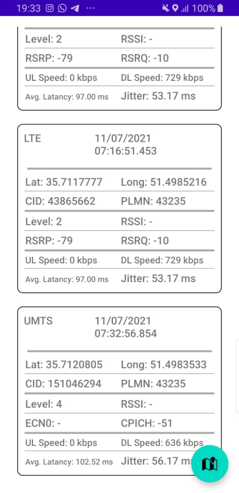

# Thorium_Android
## Trace mobile network quality on your trip

Android Base Project using Android version 10 and SDK 30(min 28)

## Preview

### LTE/UMTS/GSM View
  

  

## Our Team:
- Ahmadreza Sanatjou(a.reza.sanatjoo@gmail.com)
- Mahsa Ghaderan(mahsa.ghaderan@gmail.com)

## Features

-  Average ping latancy
-  Average Jitter
-  Downlink Speed
-  Uplink speed
-  Cell Strength Level
-  RssI
-  Quality information specify for UMTS(EcN0,CPICH-RSCP) and LTE(RSRP,RSRQ)

- Save Cell Info using RoomDataBase.
- Show each Cell on google map
- Use different coloring method due user preference

## MAP Overview
  

  

## Tech
- Android, kotlin
- MVVM architecture
- Room DataBase
- Google Map

## License

MIT
